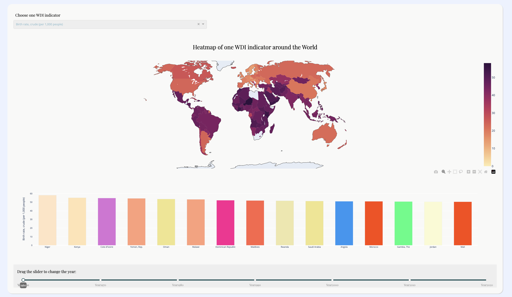

# WorldDevelopmentIndicator_DashApp

An app implemented data visualization of World Development Indicator Dataset from several aspects. Based on Dash plotly, coding difficulty on realizing animation and fantasy charts is much lower.

## Preview




## Running the app locally

We suggest you to create a separate virtual environment running Python 3 for this app, and install all of the required dependencies there. Run in Terminal/Command Prompt:

```
git clone https://github.com/WangZX-0630/WorldDevelopmentIndicator_DashApp
cd WorldDevelopmentIndicator_DashApp
python3 -m virtualenv venv
```
In UNIX system: 

```
source venv/bin/activate
```
In Windows: 

```
venv\Scripts\activate
```

To install all of the required packages to this environment, simply run:

```
pip install -r requirements.txt
```

and all of the required `pip` packages, will be installed, and the app will be able to run.
